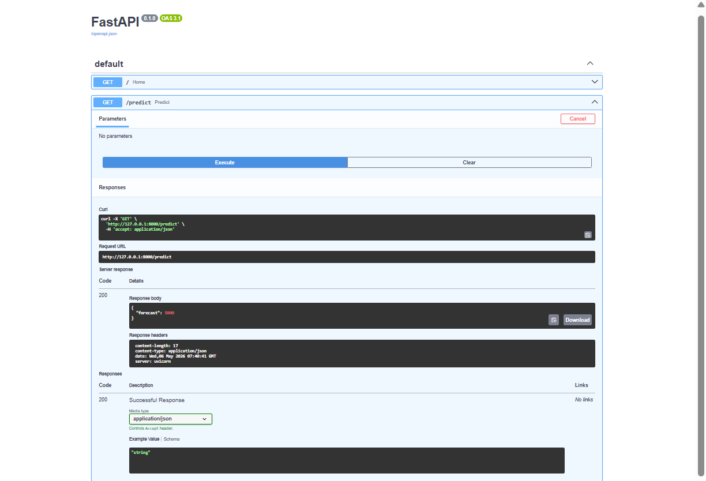

# Sales Forecasting System

## Objective
Forecast future sales using historical state-wise sales data.

## Dataset
Official dataset provided in the assignment containing:
- State
- Date
- Total
- Category

## Models Implemented
- ARIMA
- Prophet
- XGBoost
- LSTM

## Feature Engineering
- Lag Features
- Rolling Mean
- Rolling Standard Deviation
- Date-based Features

## Evaluation Metrics
- RMSE
- MAE

## Deployment
FastAPI REST API

## Best Performing Model
XGBoost

## Screenshots

- API documentation view: 
- Forecast result chart: 

