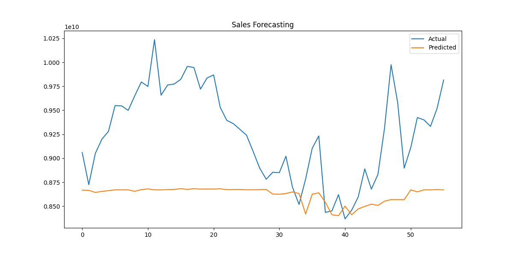

# Sales Forecasting System

End-to-end time series forecasting system using ARIMA, Prophet, XGBoost, and LSTM with FastAPI deployment and REST API support.

## Objective
Forecast future sales using historical state-wise sales data.

## Dataset
Official dataset provided in the assignment containing:
- State
- Date
- Total
- Category

## Models Implemented
- ARIMA
- Prophet
- XGBoost
- LSTM

## Feature Engineering
- Lag Features
- Rolling Mean
- Rolling Standard Deviation
- Date-based Features

## Evaluation Metrics
- RMSE
- MAE

## Installation

```bash
pip install -r requirements.txt
```

## Run Project

```bash
python main.py
```

## Run API

```bash
uvicorn app:app --reload
```

## Deployment
FastAPI REST API

## Best Performing Model
XGBoost

## Screenshots

### FastAPI Swagger Documentation


### Forecast Result Chart

